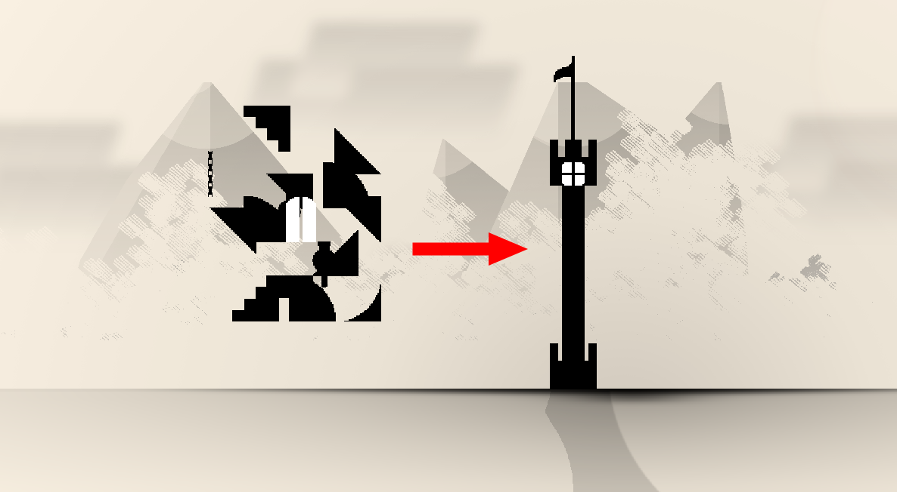

<div align="center">

# DailyBildi

**Build block by block as days go by.**

[](https://dailybildi.tomansion.fr/)

</div>


<div align="center">



</div>

## What is it?

DailyBildi is a slow-building game. Every day at midnight, each player receives **10 new blocks** drawn from the universe's catalog. You place them on your infinite canvas, one day at a time. Come back tomorrow for the next batch. Watch your creation grow over weeks and months.

- **Day 1** — you get your first 30 blocks, enough to start something.
- **Every day after** — 10 more blocks, selected by rarity from the universe's catalog.
- **The same blocks land for everyone** on the same day, so there's a shared daily theme.
- Blocks can be rotated, flipped, layered, and moved freely at any time — even old ones.
- Browse the community, see what others are building, and like your favourites.

> **→ [Try it live at dailybildi.tomansion.fr](https://dailybildi.tomansion.fr/)**

---

## Universes

Each universe is a visual world with its own background scenery and block catalog. The current universe is **Ink Castle** — a monochrome medieval fantasy theme with towers, battlements, chains and arched windows.

Want to create your own universe? [See the contribution guide](https://dailybildi.tomansion.fr/universe-contribution).

---

## Tech stack

| Layer | Tech |
|---|---|
| Frontend | Vue 3 · Vite · Phaser.js · Tailwind CSS |
| Backend | Python · FastAPI · SQLite |

---

## Dev setup

### Prerequisites

- **Python 3.9+** and pip
- **Node.js 16+** and npm

### Installation

1. **Clone and navigate to the project:**

   ```bash
   cd Dailybildi
   ```

2. **Backend Setup (Python):**

   ```bash
   cd backend

   # Create virtual environment (optional but recommended)
   python -m venv venv
   source venv/bin/activate  # On Windows: venv\Scripts\activate

   # Install dependencies
   pip install -e .

   # Configure environment
   cp .env.example .env
   # Edit .env and ensure DATABASE_URL and JWT_SECRET are set

   cd ..
   ```

3. **Frontend Setup (Vue.js):**

   ```bash
   cd frontend

   # Install dependencies
   npm install

   cd ..
   ```

4. **Start the Development Servers:**

   Terminal 1 - Start backend:

   ```bash
   cd backend
   python -m uvicorn app.main:app --reload
   ```

   Terminal 2 - Start frontend:

   ```bash
   cd frontend
   npm run serve
   ```

5. **Open your browser:**
   - Frontend: http://localhost:3000
   - API Documentation: http://localhost:8000/docs

### Docker Setup

This project includes a Dockerfile that builds and runs both frontend and backend in a single container.

**Build the Docker image:**

```bash
docker build -t dailybildi .
```

**Run the container:**

```bash
docker run -p 8000:8000 dailybildi
```

**With environment variables (.env file):**

```bash
docker run -p 8000:8000 --env-file backend/.env dailybildi
```

**With data persistence:**

```bash
docker run -p 8000:8000 -v dailybildi-data:/app/data dailybildi
```

**Access the application:**
- Frontend & API: http://localhost:8000
- API Documentation: http://localhost:8000/docs
